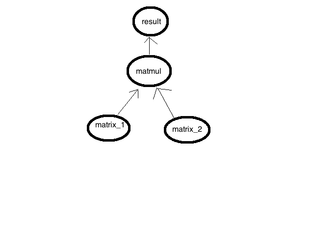
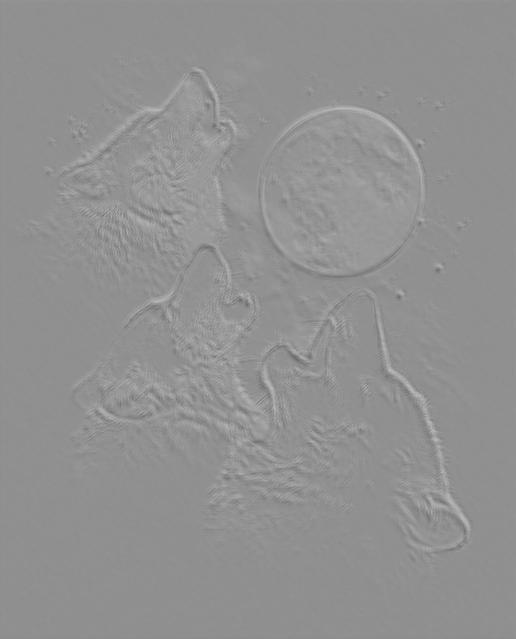
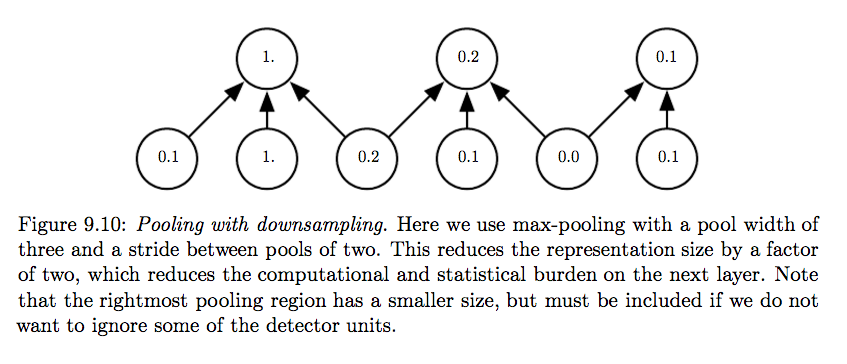

#TensorFlow
This is going to be a slow-pace tutorial, so I beg your pardon if it's too verbose. This repository is for a Neural Network introductory course at the University of Notre Dame (CSE 40868/60868). Author: Toan Nguyen, September 2016.

##1.	Installation

###1.1.	Local Machine
These instructions assume that you are using python 2.7 on a 64-bit CPU only machine.

Mac:
```bash
$ sudo easy_install -–upgrade six
$ export TF_BINARY_URL=https://storage.googleapis.com/tensorflow/mac/tensorflow-0.9.0-py2-none-any.whl
$ sudo pip install --upgrade $TF_BINARY_URL
```

If you're using Homebrew Python then:
```bash
$ export TF_BINARY_URL=https://storage.googleapis.com/tensorflow/mac/tensorflow-0.9.0-py2-none-any.whl
$ pip install --upgrade $TF_BINARY_URL
```

Linux:
```bash
$ export TF_BINARY_URL=https://storage.googleapis.com/tensorflow/linux/cpu/tensorflow-0.9.0-cp27-none-linux_x86_64.whl
$ sudo pip install --upgrade $TF_BINARY_URL
```
Methods for using virtualenv, anaconda, and docker can be found [here](https://www.tensorflow.org/versions/r0.9/get_started/os_setup.html)

To ensure consistency, let's all use Python 2.7 along with Tensorflow 0.9 for now. You're free to use different versions if you want.

###1.2.	CRC Machines

The TensorFlow setup on the CRC machines is optimized for its GPU, making it much faster. To run a TensorFlow program on a CRC machine, use the following template for your job script:

```bash
#!/bin/csh  
#$ -q gpu@qa-titanx-001  
#$ -M <your email>
#$ -m abe  
#$ -N <name of your job>

module load python/2.7.11  
module load tensorflow
setenv CUDA_VISIBLE_DEVICES 0

cd your-working-directory
python tfscript.py
```
More information on http://wiki.crc.nd.edu/wiki/index.php/Main_Page

#### A note on CUDA_VISIBLE_DEVICES
Tensorflow by default will try to grasp all the available GPU cards. Don't do this! CRC resources are limited, and everyone should receive a fair share. Normally your model will fit into a GPU card on titanx-001 (12GB of memory). To limit your job to a certain GPU card only, use the ```CUDA_VISIBLE_DEVICES``` envrionment variable. In above jobscript we set it to 0, i.e. use the GPU card numbered 0. To check if there's free GPU card, login to CRC, then run this command ```qrsh -q gpu@qa-titanx-001```. If the node titanx-001 is free, you shall have no problem logging in via this command. Once you're on titanx-001, run ```nvidiasmi```. It should show you which GPU cards are being used. There are 4 of them, 0, 1, 2, and 3. Save the free one's number, and use it for the job script above.

If you want to run two scripts at once, make sure to have the CUDA_VISIBLE_DEVICES set to different values (0 or 1).

You submit job scripts by using the command: ```qsub job.script```

###1.3.	Test Installation

To ensure your setup works, attempt to run the following code:

```python
import tensorflow as tf
hello = tf.constant('Hello, TensorFlow!')
sess = tf.Session()
print(sess.run(hello))
```
##2.	What is TensorFlow
From https://www.tensorflow.org/:
TensorFlow™ is an open source software library for numerical computation using data flow graphs. Nodes in the graph represent mathematical operations, while the graph edges represent the multidimensional data arrays (tensors) communicated between them. The flexible architecture allows you to deploy computation to one or more CPUs or GPUs in a desktop, server, or mobile device with a single API. TensorFlow was originally developed by researchers and engineers working on the Google Brain Team within Google's Machine Intelligence research organization for the purposes of conducting machine learning and deep neural networks research, but the system is general enough to be applicable in a wide variety of other domains as well.

##3.	TensorFlow Tutorial
If Keras helps you to quickly build and run neural networks, Tensorflow guides you to deeper understanding of how the networks work. It will take more effort to work with Tensorflow, but so is the rewarding. In this section, I'll first give an overview of the computational graph in Tensorflow, then we'll look at how to construct and run an actual simple graph. Lastly, we will see some operations which we will use in our assignment.

###3.1 Tensorflow overview
There's no better way to visualize Tensorflow than the provided gif. This gif depicts a classic MNIST example, in which we have some image data of digits, each of shape [28, 28], and we need to classify each image into one of 10 classes (digit from 0 to 9). This gif shows only one hidden layer with ReLU activation followed by a softmax layer.


Let's look at the nodes:

* The oval node named ```Input``` is a special one called ```placeholder```. It's where your data enters the graph.
* Our image has a shape of 28x28 pixels, but if for some reason we want to reshape it to 784x1, we define a ```Reshape``` node which takes the data flown from ```Input```, and an argument ```shape=[784, 1]```. The output of this node is a Tensor of the same data, but is "looked at different view" and has shape 784x1. In Tensorflow, we define this operation by calling ```tf.reshape(<tensor>, <new_shape>)```
* In the next step, we want to put our data through a hidden layer, which projects our image from 784-D to, say, 100-D. To do this, we define two variables, weights ```W_hl``` of shape [784, 100] and biases ```b_hl``` of shape [100]. We know we need to do matrix multiplication of our data with ```W_hl``` and then add the result with ```b_hl```. To do this, we define two operations ```Matmul``` (```tf.matmul(M1, M2)```), and ```BiasAdd``` (```tf.add(A, b)```) and carefully connect the right data flows to each operation. The final output will go through a Rectified Linear Unit (```tf.nn.relu(x)```)
* Lastly, we put our data through a softmax layer which calculates the probability of each data sample belonging to each of the 10 classes (0-9). To do this, we need to calculate the logits similarly to the ReLU layer (```W*x + b```), but without a ReLU activation.
* The final softmax output is compared against the true labels to get the cross entropy loss. Our goal is to minimize this loss as much as possible. Tensorflow automatically calculates the gradients and do backpropagation update to each of the variables for us. This is usually done by creating an ```optimizer```. For example, ```optimizer = tf.train.AdamOptimizer()``` creates an Adam Optimizer. Then calls out ```optimizer.minize(loss)```.

###3.2 Building the graph
So let’s build the appropriate code. We know that in Tensorflow we build a graph, then we feed the data in, then the data flows through the graph, passing the operation nodes and gets transformed into the final result. A normal Tensorflow workflow consists of two phases, first constructing the graph, then executing it. In this section we'll talk about how to construct a graph in Tensorflow.

Let's say we want to write a program which multiplies two matrices of shape 2x3 and 3x1. A Tensorflow graph for this program is:


```python
import tensorflow as tf

# The ```Input``` node, which actually consists of two ```placeholders``` in this case
# We define the type of the placeholder and its shape
matrix_1 = tf.placeholder(tf.float32, [2, 3])
matrix_2 = tf.placeholder(tf.float32, [3, 1])

# The ```Matmul``` node
result = tf.matmul(matrix_1, matrix_2)
```

This graph could look like this:  


###3.3 Executing
Simply speaking, to run the graph we need a ```Session```. And to get the value of some tensor in the graph, we pass it to ```sess.run(the_tensor)```. Or, if we want to calculate the values of a list of tensors, do ```sess.run[tensor_1, tensor_2, ...]```. Also, we have to close the session after use. To avoid forgetting this, we use (like with ```file```) ```with tf.Session() as sess:```. The code looks like this:

```python
with tf.Session() as sess:
	result = sess.run(output_tensor)
	print(result)
```

In practice, we construct a graph. Normally it takes some input values via ```placeholders```. Then we launch a session. Under this session, we feed in some data and get the output. For the above matrix multiplication example, the code looks like this:

```python
import tensorflow as tf
import numpy

with tf.Session() as sess:
	# 1. Construct the graph
	# The ```Input``` node, which actually consists of two ```placeholders``` in this case
	a = tf.placeholder(tf.float32, [2, 3])
	b = tf.placeholder(tf.float32, [3, 1])

	# The ```Matmul``` node
	result = tf.matmul(a, b)

	# 2. Feed data and get the output
	data_a = numpy.array([[1, 2, 3], [2, 3, 4]])
	data_b = numpy.array([[1], [2], [3]])

	# We map the feed data with corresponding placeholders with a dictionary
	feed = {
		a: data_a,
		b: data_b
	}

	# Execute
	output = sess.run(result, feed)
	print output # should be [[14], [20]]
```
###3.4 Training a neural network
In Tensorflow, we define an objective function, then use an optimizer to minimize/maximize it. Tensorflow implements many popular optimizers, from SGD to AdaGrad and Adadelta. For example, we're building a neural network which classifies images into one of 10 classes. Our neural network may have multiple convolutional layers & pooling, then finally go through a softmax layer which outputs a Tensor logits of shape [batch_size, 10]. Our objective is to minimize the cost function, which in this example is selected to be the cross entropy loss.

```python
# Construct the graph
# layer something
# layer something else
# oh, whatever
...

# Cross entropy loss
cross_entropy = tf.nn.sparse_softmax_cross_entropy_with_logits(logits, labels)
loss = tf.reduce_mean(cross_entropy)
optimizer = tf.train.AdamOptimizer()
train_op = optimizer.minimize(loss)

with tf.Session() as sess:
	# grasp data
	data = ...

	# get the feed
	feed = {
		placeholder_name_1: corresponding_data_1,
		placeholder_name_2: corresponding_data_2,
		...
	}

	sess.run([loss, train_op], feed)

	print(loss)
```
As you can see, optimizing is also an operation.

###3.5 What's next
* Read about [Variables](https://www.tensorflow.org/versions/r0.9/how_tos/variables/index.html), and [Variable scope](https://www.tensorflow.org/versions/r0.9/how_tos/variable_scope/index.html#variable-scope-example)
* See ```iris_tensorflow.py``` for an implementation in Tensorflow for the Iris dataset.
* If you want more examples, have a look at this [awesome repo](https://github.com/aymericdamien/TensorFlow-Examples)

##4. Some operations
In this section, we will look at some Tensorflow operations that we will use for the assignment.

###4.1 ReLU
There are various ways of rectification of the linear function. As you remember from the class, the simplest option is ```f(x) = max(0, x)```. In Tensorflow, this is defined by the operation ```tf.nn.relu(x)```. In code:

```python
import tensorflow as tf
import numpy

with tf.Session() as sess:
	# 1. Construct the graph
	# The ```Input``` node, which actually consists of two ```placeholders``` in this case
	a = tf.placeholder(tf.float32, [5])

	# The ```Matmul``` node
	relu = tf.nn.relu(a)

	# 2. Feed data and get the output
	data_a = numpy.array([1, -2, 3, -4, 5])

	# We map the feed data with corresponding placeholders with a dictionary
	feed = {
		a: data_a
	}

	output = sess.run(relu, feed)
	print output # should be [1, 0, 3, 0, 5]
```

###4.2 Convolution
We will use [tf.nn.conv2d](https://www.tensorflow.org/versions/r0.9/api_docs/python/nn.html#conv2d). We already discussed the convolution in class, let's see it in action here. We can use convolution to convert an image from color to gray for example. To do this, we need a filter of height = 1 and width = 1, i.e., it looks only at 1 pixel at a time, but looking simultaneously at all 3 channels (Red, Green and Blue) and giving 1 channel only (averaged intensity) as an output. Assuming that our conversion formula is ```output_pixel_value = (r + g + b) / 3```, each filter element value is 1/3. In code:

```python
from __future__ import print_function, division
import tensorflow as tf
import numpy
from skimage import io

# Out image has shape 512x512x3
input = tf.placeholder(tf.float32, [512, 512, 3])
# But tf.nn.conv2d works with batch, i.e. [batch, height, width, in_channels]
# so let's make a batch of 1 image
input_batch = tf.reshape(input, [1, 512, 512, 3])
# it looks at 1 pixel at a time, at all r, g and b channels and output 1 channel
filter = tf.ones([1, 1, 3, 1]) / 3
output = tf.nn.conv2d(input_batch, filter, [1, 1, 1, 1], 'SAME')
# Now we remove the batch-dimension
output = tf.squeeze(output, [0])

with tf.Session() as sess:
	# https://en.wikipedia.org/wiki/Lenna#/media/File:Lenna.png
	img = io.imread('./Lenna.png')
	gray = sess.run(output, {input: img})
	gray = numpy.reshape(gray, (512, 512)).astype('uint8')
	io.imsave('./Lenna_gray.png', gray)
```


In ConvNet, for a convolutional layer, we often use multiple filters at once. For example, say we want to put our batch of images through 32 filters, each looks at square area of 5x5 pixels with a stride of 1 for all directions. Also, our input images are color images, so the ```in_channels=3``` and ```out_channels=32```. The code can look like this:

```python
with tf.variable_scope('conv'):
	initializer = tf.truncated_normal_initializer(stddev=0.01)
	filter = tf.get_variable('weights', shape=[5, 5, 3, 32])
	biases = tf.get_variable('biases', initializer=tf.constant_initializer(0.1))
	conv = tf.nn.conv2d(self.input_placeholders, filter, [1, 1, 1, 1], padding='SAME')
	conv_output = tf.add(conv, biases)

	# a ReLU after that
	conv_output = tf.nn.relu(conv_output)
```

Let's see another example of using multiple filters. Here is a naive implementation of this [cool example](http://deeplearning.net/tutorial/lenet.html#the-convolution-operator). In this, we put an image through a randomly initialized convolutional layer of 2 filters, then the output is passed through a sigmoid activation layer. Note that the results look like edge detector.

```python
from __future__ import print_function, division
import tensorflow as tf
import numpy
from skimage import io

input = tf.placeholder(tf.float32, [639, 516, 3])
# Make a minibatch of size=1 out of it
input_batch = tf.reshape(input, [1, 639, 516, 3])

filter_shape = [9, 9, 3, 2]
w_bound = numpy.sqrt(9 * 9 * 3)
filter = tf.Variable(tf.random_uniform(filter_shape, minval=-1/w_bound, maxval=1/w_bound), name='weights')
biases = tf.Variable(tf.random_uniform([2], minval=-0.5, maxval=0.5), name='biases')

conv = tf.nn.conv2d(input_batch, filter, [1, 1, 1, 1], 'SAME')
conv = tf.add(conv, biases)

output = tf.nn.sigmoid(conv)

# Don't need a minibatch anymore
output = tf.squeeze(output, [0])

with tf.Session() as sess:
	# Always initialize the variables
	sess.run(tf.initialize_all_variables())

	# http://senseshaper.com/wp-content/uploads/2013/05/3wolfmoon.jpg
	img = io.imread('./3wolfmoon.jpg')
	img = img.astype('float') / 256
	outputs = sess.run(output, {input: img})
	outputs *= 256

	io.imsave('./wolf_0.jpg', outputs[:, :, 0].astype('uint8'))
	io.imsave('./wolf_1.jpg', outputs[:, :, 1].astype('uint8'))
```




About padding algorithm, read https://www.tensorflow.org/versions/r0.10/api_docs/python/nn.html#convolution.

###4.3 Pooling
We have talked about pooling in the class. A pooling layer is often placed in between successive convolutional layers. [This](http://www.deeplearningbook.org/contents/convnets.html) defines a convolutional layer = convolutional stage + activation + pooling stage. Pooling has many benefits, max-pooling, for example, (paraphrasing here) reduces the representation size, thus reduces the computational burden on the next layer.

 (Screenshot from http://www.deeplearningbook.org/contents/convnets.html)

Let's try a max pool of width = 3 and stride = 2. This should reduce the size of image by 2.  
```python
from __future__ import print_function, division
import tensorflow as tf
import numpy
from skimage import io

input = tf.placeholder(tf.float32, [512, 512, 3])
# Make a minibatch of size=1 out of it
input_batch = tf.reshape(input, [1, 512, 512, 3])

pool = tf.nn.max_pool(input_batch, ksize=[1, 3, 3, 1], strides=[1, 2, 2, 1], padding='SAME', name='pool')
output = tf.squeeze(pool, [0])

with tf.Session() as sess:
	# Always initialize the variables
	sess.run(tf.initialize_all_variables())

	# http://senseshaper.com/wp-content/uploads/2013/05/3wolfmoon.jpg
	img = io.imread('./Lenna.png')
	result = sess.run(output, {input: img})
	print(result.shape) # (256, 256, 3)
	io.imsave('./Lenna_maxpooled.png', result.astype('uint8'))
```


##5. Final note
Actually training a neural network consists of multiple steps from preprocessing data, constructing the network, making sure all the shapes fit right in. It could be beneficial to look at this [example](https://github.com/aymericdamien/TensorFlow-Examples/blob/master/examples/3_NeuralNetworks/convolutional_network.py) of how to do the training and evaluation, specifically in the context of ConvNet with MNIST data. This example is similar to the assignment, albeit CIFAR-10 is more complicated than MNIST.
