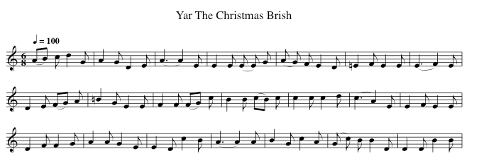

# Assignment 3: Character RNNs
This assignment is based on the [awesome blogpost](http://karpathy.github.io/2015/05/21/rnn-effectiveness/) which literally inspired a bunch of cool projects. In this assignment, you will build a character-level language model. Roughly speaking, it means you will train a model which can predict the next character given a sequence of previous characters. For example, if trained on English, given the sequence 'hell', your model may predict that the next character is likely 'o' (or space?). Please refer to the blogpost for better explanation (it's a really good read, I promise).

## Your tasks in this assignment:
* Read [http://karpathy.github.io/2015/05/21/rnn-effectiveness/](http://karpathy.github.io/2015/05/21/rnn-effectiveness/)
* Choose your data. You can choose one of datasets mentioned in Karpathy’s blogpost, or find other dataset that is interesting for your. Remember to choose a corpus whose content has some special structure, so that it's easier for evaluation. For example, you can train a model to learn to write a C program in linux kernel style, or generates writing that sounds like Shakespear's or Leo Tolstoy’s. In this github repository we also provide an example dataset for you, which is a copy of over [1600+ Xmas Carols and Hymns in ABC notation](http://www.stephenmerrony.co.uk/ABC/Carols/). Using this dataset you can train your network to generate its own Xmas Carols!
* Train a character-level RNNs using Tensorflow
* Every now and then, sample from your model. Save the iteration number and the sampling output to a file so that you can check your model's progress.
* Write a report (.pdf format only) detailing what data you use, your model's architecture (number of layers, hidden state size), and your training strategy. Also discuss your model's learning progress based on the sampling outputs.
* Prepare a README.md which shows how to run your code and reproduce your result.

REMEMBER: it can take a few hours to train your model, so please don't wait until the last day to work on this assignment. Start now and at least read the blogpost before the Thanksgiving break.

In the following sections, I'll explain how to build and train a character-level recurrent neural network with Tensorflow.

## Build a character-level language model
### Prepare the data
Your first step is to convert each character to its corresponding index. For example, building a word string 'hello ' requires a language built of 5 characters (including space). Hence, I can have a vocabulary like this:
```python
vocab = {
    'h': 0,
    'e': 1,
    'l': 2,
    'o': 3,
    ' ': 4
}
```
So if my data is 'hello olleh', it can be represented as ```[0 1 2 2 3 4 3 2 2 1 0]```. The reason is explained in the next step.

We are essentially trying to predict the next character given the previous sequence, so one way you can prepare the input data is to split it into sequences, and the target of each input sequence is itself shifted to the right one character. For example, if our corpus is 'hello holle', and we want to train our RNN on sequences of length 4 only, then our input and target can be:
```python
'hell' -> 'ello'
'o ho' -> ' holl'
...
```
And the corresponding sequence of indices are:
```python
0 1 2 2 -> 1 2 2 3
3 4 0 3 -> 4 0 3 2
```
In fact, you can split the data however you want, as long as the input and its target correspond as explained.  
  
You must consider the newline character as well. In python, to split a string into a list of character:
```python
a = 'hello'
print(list(a)) # ['h', 'e', 'l', 'l', 'o']
```

Be careful if you use non-ascii data, since you have to choose correct encoding. 

### Character embedding
We operate on characters, but the network only knows vectors and matrices, so the first thing we do is to put the input characters into a common embedding space. Assuming that each character is represented as a vector of shape [N], and our training data has a vocabulary of size V, then we can represent the embeddings of the whole vocabulary as a matrix of size E of shape VxN. Given this, to obtain the embedding of the character i<sup>th</sup>, we just need to get the row i<sup>th</sup> in the matrix E. Tensorflow already does this for us. 

```python
input_data = tf.placeholder(tf.int32, [batch_size, seq_length], name='input_placeholder')
embedding = tf.get_variable("embedding", [vocab_size, rnn_size]) # rnn_size is embedding dimension N above
input_embeddings = tf.nn.embedding_lookup(embedding, input_data) # Shape [batch_size, seq_length, rnn_size]
```

### Unfolding the RNNs
First, you have to define what kind of RNN cell you want to use. This example uses LSTM:
```python
cell_fn = rnn_cell.BasicLSTMCell
cell = cell_fn(rnn_size)
```

If you want to stack multiple layers of RNNs:
```python
cell = rnn_cell.MultiRNNCell([cell] * num_layers)
```

There are many ways how to unfold RNNs in Tensorflow. Here I show the basic one, feel free to use other syntax/method.

```python
inputs = tf.split(1, seq_length, inputs) # list of inputs, each for one time-step
outputs = []
state = self.initial_state
for i, inp in enumerate(inputs):
    # We call LSTM variables by get_variable for the first time-step
    # only, the reset should be reusing these variables
    if i > 0:
        tf.get_variable_scope().reuse_variables()

    inp = tf.squeeze(inp, [1])
    output, state = cell(inp, state)
    outputs.append(output)
```

The ```outputs``` is a list of outputs, each from a timestep. Similar to that with CNN, we calculate the softmax logits using these outputs, then calculate the loss, the gradients and do the back-propagation. Calculating the loss is straightforward, but let's use Tensorflow's provided function:
```python
loss = seq2seq.sequence_loss_by_example([logits],
        [tf.reshape(targets, [-1])],
        [tf.ones([batch_size * seq_length])])
loss = tf.reduce_sum(loss) / batch_size / seq_length
```

Training RNNs was difficult due to many issues, one of them is exploding gradient. Simply put, it means when we back-propagate the gradients over a long sequence, it accumulates and gets too large and causes overflow. To solve this, we simply clip the norm of the gradients to below a threshold (do you remember from the class that norm clipping is only one of various ways how to clip gradients?). To do this in Tensorflow:

```python
tvars = tf.trainable_variables()
grads, _ = tf.clip_by_global_norm(tf.gradients(loss, tvars), grad_clip)
optimizer = ...some optimizer...
train_op = optimizer.apply_gradients(zip(grads, tvars))
```

People often use ```grad_clip = 5.0```.

### Sampling the model
Sampling is straightforward. You just feed in one character at a time, calculate the output probability distribution (put that ```logit``` through the softmax function), then from this distribution, get the output character. Then again use this output as the next input. Remember to use the output cell state from previous time-step as initial cell state for the next time-step.  

It's tempting to think that we only need to select the character which has the highest probability. In fact this works, but since we already have a distribution over all character types, it'd better to use [weighted random sampling algorithm](http://stackoverflow.com/a/4463613/2005810).

## Example 1: Music
I train a ```rnn_size=512, num_layers=2, batch_size=64, seq_length=50, grad_clip=5.``` RNN using the music notation data. Since each music sheet tends to start with ```X: ```, I feed this string into the model first, then continue to sample, 5000 characters at a time. Let's see the result (long output is clipped):

```python
# Epoch 1: Totally rubbish
X: F, C 9 | C E D | (D, E,/ B,, | A,, E,,2 d,, | B,,2 A,,, G,,,, | B,,,, D,,, D,, | (D,,,,, F,,,,  | F,,  F,, D,, A,,, | F,,,, | C,,,,, | D,,,, F,,,, | E,,,,  D,,,, A,,,, | [D,,,,,,,,,,,,] ^B,,,,, [D,,,,,,,,,,,,,,,,] [F,,,,,,,,,,, | D,,,,, F,,,,,, A,,,,, A,,,,,/ F,,,,,/8 ^D,,,, E,,,, | D,,,, |z,,,,, | E,,,,,,,,,, | C,,,,,,,, A,,,,,,,,,, A,,,,,,,,,, ^D,,,,,,4,,,,,,,,,,, | D,,,,, A,,,,, F,,,,,,,,,,, [D,,,,,,,,,,,,,,,,,,,] D,,,,,, z | | [D,,3,,,] [C,,,,,,,,,,,,,,,,,,,,,,,,,,,,,,, [G,,,,,,,,,,,,,,,,,,,,,,,,,,,  C,,,,,,,,,,,, B,,,,, | G,,, B,,,, D,,,,,,,,,,,,,,,,,,,,,, A,,,,,, B,,,,,,,, K,,,,,, [D,,,,,,,,,,] [F,,,,,,,,,,,,,,,,,,,,,,] | D,,, ^B,,,,,,,,,,, A,,,,,,,,,,,,  G,,, F,,,,,,,,,,,,,,,,,,,,,,,,,,,,,,,,,,, ^G,,,,,,, E,,,,,,,,,,,,,,,,,,,,,,,,,,,,,, [C,,,,,,,,,,,,,,,,,,,,,,,,,,,, C,,,,,, [B,,,,,,,,,,,,,,,,,,,,,,, G,,, F,,,, | [B,,,,,,,,,,,,,,] | B,,,,,, B,,,,,, G,,,,,,,, [D,,,,,,,,,,,,,,,,,,,,,,,,,,, F,,,,,,,,,,,,,,,,,,,,,,,, B,,,,,, | D,,,,,,,,,,,,,,,,,,,  F,,,,,,,,,,,,,,,, [B,,,,,,,,,,,,,,,,,,,,,,,,,,,,,,,,,,,,,,,, G,,,, F,,,, | F,,, C,,,, A,,,, [D,,,,,,,,,,,,,,,,,,,/ [D,,,,,,,,,, D,,,,,,,, E,,,,,,,,,,,,,,,, _G,,,,, [D,,,,,,,,,,,,,,,,,,,,,,,,,,,,,,,,,  B,,,,, [...]

# Epoch 3: Already knows that some number goes after X:, knows to add 'M:', 'K:'
X: 4/4
M: 1/4=Q00K
K: E
[V: P1]  E E | F A (G A/) F | (F F) D | E D | F E E | d (B/c/) c | B d e | (c A) A F | B2 | D E (E/E/) | E E E G | D E A | F D E | (E A) D | E E [E2G2] | E G E D | B, B, [E,/E,/] F,/ | [E,,/F,/] [D,,/F,/] [D,,/F,/] | [C,,3/] [C,,/] E,,/ C,/ | [C,,3/F,3/] [K: G]  | [M: 4/8]  [K: E]  | [M: 1/4]  D,/ A,,/ C, B,,/ | D, C,/ F, G,/ D, [K: E]  | [M: 4/8]  [C,,/G,,/] [D,,/G,,/] [D,,/G,,/] [D,,/G,/] [B,,/G,/] [D,,G,] [G,,/G,/] [C,/G,/] | [B,,/G,/] [D,/C/] G,/ G,/ C,/ | [C,3/C3/] A,/ A, | [C,3/G,3/] [C,3/4G3/4][C,/4B,/4] | [D,3/4G,3/4][B,,/4B,/4] | [B,,3/4B,3/4][B,,/4B,/4] G,3/4B,/4 B,,3/4B,,/4 ^B,,/[B,,/4B,,/4]z3/4 [B,,/4B,/4G/4][B,/4B,/4B/4] | [B,3/4B,3/4][B,/4B/4] z [B,3] | [G,3/4^^A,3/4][B,/4B/4] [B,3/4^3/4][B,3/4B3/4] [B,3/4][B,/4^B/4] [B,3/4B3/4][B,/4B,/4] | [B,3/4][B,,/4B,/4] | [B,,3/4^B,3/4][B,/4B,/4] [B,3/4B,3/4][B,/4B,/4] [B,3/4B,3/4][B,/4B,/4] | [B,,3/4^B,3/4][B,/4B,/4] [B,3/4B,3/4] [B,/4B,/4] | [B,3/4][B,3/4-][B,/8] [B,,3] | [C,3/4C3/4][C,/4-] [C,C] | [C,3/4C3/4][C,/4-C/4] | [C,C] [C,/4C/4][C,3/4-C3/4-] [F,/8F,/8][F,/4-F,/4][F,,/4F,/4] | [B,,/8F,/8][F,,/4-F,/4][F,,/4F,/4] | [F,,/F,/][F,,/8F,/-] | D,/8D,/8D,/8D,/8D,/8D,/8D,/8 C,/8D,/8D,/8D,/8z/8 D,/8D,/8D,/8D,/8 | F,,/8D,,/8D,,/8D,,/8D,,/8D,,/8 E,,/8D,,/8D,,/8D,,/8D,,/8 D,,/8D,,/4 | D,,/8D,,/8G,,/8 D,,/ C,,/D,,/8D,,/8D,,/8D,,/8 A,,,/8D,,/8D,,/8D,,/8D,,/8D,,/8 | [D,,3/4D,,3/4]D,,/4 | [B,,,^^^^,,/8^^^^=,,,/8^,,/8^D,,3/4-D,,/8 F,,/8D,,/8D,,/8F,,/8D,,/8F,,,/8 | E,,,/8D,,,/8D,,/8 D,,,/8D,,/8D,,/8D,,/8D,,/8 E,,,[...]

# Epoch 10: Starts to generate title too!
X: 0
T: The Fore Chirs Choist
L: 1/4
M: 2/8
Q: 1/4=120
K: G
[V: P1] " d d c B | B2 A F | F2 F D | (F E) F | F2 (F F) | F2 (F G) | E2 E2 | A2 F E | (F E) G B | F2 E2 | F2 E2 | F2 E2 | G2 D2 | F2 G2 | A2 A2 | B2 c2 | c2 A2 | A2 G2 c2 | B2 B2 F2 | F2 F2 E2 D2 | E2 D2 D2 | D2 E2 B,2 | B,2 B,2 F,2 | G,2 B,2 | B,2 F,2 | G,2 G,2 | A,2 (A,2 B,) | G,2 F,2 F,2 | D2 E2 (B, D) | B,2 E2 B,2 C2 B,2 | A,2 D2 D2 (B,2 C)) | B,2 C2 | F,2 A,2 | B,2 A,2 | (B, G,) | A,2 F, | F,2 | B,2 | A,2 D | D2 A, | A,2 B, | (A, F,) A, | G,2 C | F,2 C,2 | D,2 A,,2 | G,,2 F,,2 | B,,2 D,2 | F,2 E,2 | F,2 C,2 | D,2 C,2 | C,2 | D,2 F,2 | G,,2 A,,2 | D,2 D,2 | F,2 F,2 | E,2 G,2 F,2 | F,2 C,2 | G,,2 D,2 G,2 G,2 G,2 | G,,2 C,2 | (C,2 C,2) G,,2 | E,2 B,,2 G,2 G,2 F,2 (E,2 E,) | G,2 E,2 E,2 | G,2 D,2 A,,2 _A,,2 G,,2 _A,,2 | G,,2 C,2 A,,2 A,,2 | B,,2 G,,2 (C,2 C,2) G,2 | D,2 F,2 D,2 | G,,2 B,,2 F,,2 | B,,2 A,,2 | C,2 D,2 E,2 | z4 | G,2 G,2 G,2 F,2 | D,2 F,2 | F,2 G,2 G,2 | (G, G,) (G, G,) | G,2 G,2 C,2 | D,2 D,2 | G,,2 G,,2 | B,,2 C,2 | G,,2 E,2 G,2 | C,2 E,2 E,2 | F,2 F,2 G,2 | G,2 G,2 G,2 B,2 | F,2 E,2 | E,2 B,,2 | G,2 G,2 | A,,2 A,,2 F,,2 | D,2 D,2 E,2 | D,2 c,2 C,2 | F,2 F,2 C,2 G,,2 | G,,2 G,,2 A,,2 | F,,2 F,,2 F,,2 | G,,2 (C,2 D,) | G,,2 G,,2 | G,,2 A,,2 E,2 | E,2 (F, D,) G,2 | E,2 D,2 B,,2 | A,,2 B,,2 G,2 | C,2 D,2 D,2 C,2 | B,,2 B,,2 | B,,2 C,2 D,2 | B,,2 C,2 D,2 | G,,2 F,,2 | A,,2 A,,2 B,,2 | (D,4 D,2) D,2 D,2 D,2 D,2 | (D,2 G,) (G, D,) C,2 | (A,,2 A,,2) G,,2 G,,2 G,,2 | E,,2 B,,2 C,2 C,2 B,,2 | B,,2 A,,2 E,2 E,2 B,,2 ^A,,2 ^C,2 | (B,,2 C,2) G,2 | E,2 D,2 D,2 | D,


# Epoch 41: A bunch of songs
X: 0
T: Lark! E Christmas Fall The Singing
L: 1/4
M: 2/4
Q: 1/4=80
K: D
[V: P1]  B | d C B, D | E F B B | (A ^G A) A d | c B B c | G A A B | e e c d | c B c d | d c B A | G G A d | (c/B/) A G B | B (A/G/) F d | d d e d | d c d B | A A A G | (A/B/) c (B/A/) (G/F/) | E d B G | A B d d | d (c/B/) A E | D (D/C/) G A | (B/c/) e f B | B A G G | A3/ F/ C E | A G E E | D3 D | A (A/G/) F F | C B, (A,/G/) F | =F F E G | A G G G | F D C F | F E C F | (F G/F/) (E/F/) F | C A, G, E | F (E/F/) ^G A | c A F (E/D/) | C D D D | (E/F/) A (G/A/) B | B (B/A/) E E | D A, F E | E E F | F E (E/F/) | G F E | F D G | G E _E | E F G | A (A/G/) F | (F/G/) F G | A (A/G/) F | G F E | F G (F/E/) | E (F/E/) D | E D (E/D/) | D (D/E/) F | A (A/B/) c | F2 (F/E/) | D (F/G/) (A/G/) | F F E | F (F/E/) D | F E F | F D C | B,2 C | F A G | B D C | D2 C | D C (D/C/) | D B, D | G, A, G, | C2 B, | A, A, A, | A, B, B, | (A,/G,/) c, B, | A,2 C | E A, D | C A, C | D B, C | D C B, | C A, B, | B, G, F, | G,2 D, | E, D E | E E E | D F E | D E E | D E E | (E D) e | E E E | E E E | E E F | E F E | F2 (F/G/) | B A G | G2 G | F F A | G G A | B (A/G/) F | E (E/F/) G | D B, A | F (F/E/) D | C D C | D C F, | A,2 (G/F/) | E G (F/E/) | D2 (E/F/) | G G (F/E/) | F D C | B, B, B, | C B, A, | [M: 3/2]  ^C D E D | (D C) C | D2 (D/C/) | B, A, G, | A,2 G, | F, G, C | G,2 G, | D G, F, | B, C C | D2 (C/B,/) | A, D (A,/G,/) | F,2 (F,/G,/) | A,2 A, | E C D | C (B,/A,/) (G,/F,/) | F,2 E, | [M: 3/2]  F, G, A, B,, | [M: 6/4]  G, C, C, B,, | E, G, G, A, | B, G, (F,/G,/) A, | G, (F,/E,/) D, (D,/B,,/) | (C,/D,/) (F,/G,/) A, F, | G,3 C, | C, C, C, B,, | B,, B,, (B,,/C,/) D, | E, (E,/E,/) D, C, | G,, G,, C, C, | G,, C, G,, D, | F, G, C, | D, F, A,, | A,,2|]

X: 0
T: Sat ing An Rosting Lig
L: 1/4
M: 6/8
Q: 1/4=120
K: Eb
[V: P1]  D E/ A c/ | (B3/ A)z/ | (A/ G/) F/ G | F/ D/ D/ D/ F/ F/ | B/ B/ | d/ c/ B/ (A/4G/4) | (F/4G/4A/4B/4 c/) A/ B B/ (c/4B/4) | A E A d/ (c/4B/4) | c B/ d A/ | A G/ A e/ | d d/ A B/ | A G/ c A/ | c d/ c (B/A/) | G F/ (F/ E/) E/ | c B/ A G/ | E d/ f c/ | d c/ B B/ | c d/ e d/ | d A/ G G/ | A B/ B A/ | G G/ G A/ | B A/ A e/ | (d3/ d/) | G/ A/ B/ | c B/ | c d/ | (c/B/) (A/G/) | D D | G A | A (A/B/) | A A (B/c/) | B B | B c | (B/c/) d | e2 | c (B/A/) | G A | B2 | c B | d2 B/ d/ | d/ B/ A/ D/ | G/ B/ B/ G/ | c/ c/ B/ D/ | E/ F/) G/ A/ | (B/ A/) G/ B/ | (A/ G/) A/ (G/ F/) ^E/ | A/ A/ G/ F/ E/ E/ | D/ F/ e/ d/ d/ d/ | c/ d/ c/ A/ (B/4 c/4) d/ c/ | B/ B/ B/ B/ G/ F/ | d/ d/ A/ F/ F/ | G/ E/ C/ F/ E/ | D/ E/) F/ (E/4D/4) | F/ G/ B/ d/ | (d/c/) (B/4A/4) | B3/ G/ | B/ B/ c/ c/ | (B/4c/4) c/ | (B/A/) A/ (G/4F/4) | G/ d/ (c/ B/) | (A/ B/) c/ A/ | B/ B/ (A/4G/4) | (A/G/) (A/ B/) | G A | (B/ A/) B | c3/ d/ | c (B/ A/) | G B | G/ A/ B/ B/ | (c/ d/) (c/4B/4) | d A/ F/ | c c/ (d/4 e/4) d/ | (c/ d/) (c/4B/4) (A/4G/4) | (F/4G/4) A/ (A/4G/4) | (A/4B/4) (c/4d/4) _c/ B/ | B/ B/ c/ B/ | c/ B/ G/ B/ | c/ d/ c/ c/ | d/ d/ e/ d/ | c/ d/ c/ B/ | c/ G/ A/ A/ | B/ B/ B/ F/ | E/ D/ E/ G/ | (A/ G/) (F/ G/) | A3/ G/ | (A/ F/) c/ B/ | (A/ G/) C/ E/ (F/ D/) | C A,/ A/ c/ | (B/ c/) B/ G/ | (F/ E/) E/ F/ | (E/ F/) ^F/ G/ | E (E/ D/) | (E/ E/) =E/ | E/ E/ E/ | E/ E/ (E/4D/4) | E/ D/ F/ =E/ | (F/ E/) D/ C/ | E3/4 E/4 A/ G/ [F/A/] | (G/F/) (E/4F/4) | [(E/(G/][C/)F/)] [D/F/] | [D3/F3/] [D/F/] | [DF] D/ [EG] | F/ G/ (A/G/) A/ | F3/ c/ G/ (F/ | G/) (A/ c/) (B/ A/) G | B/ G/ G/ F/ F/ F/ | F/ E/ F/ B/ A/ | (G/ A/) B/ c/ | c/ F/ G/ F/ | E/ d/ G/ G/ | E/ F/ D/ E/ | F A/ F/ | F D/ D/ | E (E/ F/) | E E | F/ E/ F/ F/ | E/ E/ | E/ E/ E/ C/ | D/ D/ C/ E/ E/ C/ | C/ C/ C/ G,/ | F/ F/ C/ c/ | B,/ E/ F/ F/ | C/ E/ E/ (E/4F/4) | =E/ F/ (G/4F/4) G/ E/ | D/ A,/ G,/ D/ | D/ D/ D/ D/ | D3/ D/ | G/ D/ D/ E/ | D/ D/ C/ B,/ | F/ D/ D/ E/ | D/ C/ F/ A/ | G3/ | E/ G/ G/ A/ | (B/ c/) (B/4c/4) d/ d/ | (c/B/) (c/B/) | G B | c B | (A/G/) A | c (B/c/) | d A | (G/A/) (B/c/) | d3/ c/ | G (A/B/) | (c/B/) G | F (E/F/) | c c | d c | (B/c/) d | d (c/B/) | A B | B (G/F/) | E (F/G/) | A G | F2|]

X: 0
T: Yar The Christmas Brish
L: 1/4
M: 6/8
Q: 1/4=100
K: C
[V: P1]  (A/B/) c/ d G/ | A G/ D E/ | (A3/ A) E/ | E E/ (E/ E/) G/ | (A/ G/) F/ E D/ | =E  F/ E E/ | (E3/ F)  E/ | D E/ (F/G/) A/ | =B G/ E E/ | F F/ (F/G/) c/ | B B/ (c/B/) c/ | c c/ c d/ | (c3/ A) E/ | E F/ E E/ | D F/ F G/ | A A/ G E/ | E D/ c B/ | (A3/ A) A/ | B G/ c A/ | (G/ c/) B/ B D/ | D D/ B B/ | A A/ A A/ | d c/ e (c/4B/4) | A A/ (G/F/) E/ | B A/ d A/ | E E/ (F/G/) A/ | B B/ c d/ | F F/ d A/ | B G/ c A/ | (B3/4B/4) B/ (A/G/) F/ | (F3/4F/4) F/ F F/ | =F F/ E E/ | E E/ C C/ | E E/ E E/ | E E/ E D/ | D D/ D D/ | E E/ E F/ | E E/ (E/E/) F/ | (E/E/) F/ C C/ | (D/E/) E/ D B,/ | E E/ D A,/ | (B,3/ B,) D/ | E D/ =C C/ | | (C/D/) E/ (D/C/) (B,/A,/) | B, (A,/G,/) A, F, | E, (F,/G,/) (A,/B,/) C | C (C/B,/) D B, | G, B, A, G, | C B, D B, | B, B, B, B, | D (C/B,/) A, (B,/A,/) | (G, F,) (G,/A,/) B, | D G, (B,/A,/) B, | B, (B,/A,/) B, (A,/B,/) | A, A, (A,/G,/) F, | B, C C G, | A, C A, G, | E, B, B, B, | C C C C | B, B, B, G, | D, G, G, (G,/B,/) | (A,/B,/) (C/B,/) (A,/G,/) F, | G, F, B, E, | F,
```

As you can see, the model can remember the structure of the training data, and generate text of very similar structure. Actually, many of these scripts have correct syntax, and while some have incorrect syntax here and there, you can still play it. Try play them with this [software](http://www.nilsliberg.se/ksp/easyabc/). I also attach a sample song generated by the model in this repo ("Yar The Christmas Brish"). Checkout the generated sheet:


## Example 2: Movie scripts
I also train a model on a bunch of Star Wars movie scripts and ask it to generate based on this heartbreaking line ```You were the Chosen One! It was said that you would, destroy the Sith, not join them. It was you```

```python
#Epoch 1  
You were the Chosen One! It was said that you would, destroy the Sith, not join them. It was you d c s t we t t r e a e n  m  t oe c e  oe u E m h oe h he y o  d o a r s n    de  .e o de a m o a h he o dt a  m we   o a se o
 a a e  n d r e b oe e gt e m n t f s ge he l a n e n  i t  o g l ee e e ne d o ke o t Ca f  a be c lte n n e a n p .   de   aeee r r  h h  lte e a c a te a  eat M d ue a r et i  et e t e e ie v e at n a at s de d k na
 h m t i - f o e o lte e a rt t h p e r o O m t  d d t ge w h u r o e i h l Ne  pe t . d o h ct s   h o L fe h de me
 b h fe  u f h i ne se d e f . d s o tt l e e t r  o t d e ke I s m e t l  w "e l g
  T . - d d  u ae et a o l
 f i P u t f e a o ,e t a c P u
 se h i e  eeee  e o t f t a u he o h o ae h ue f a a f t ae l n h a h i p u he o n e s i  i  u t ee e a  ee ae e  ne p s m i se a m o  a  he a o  e E l n i h d n h p u a ne  k o et e be  t h e b  a dt s J u i t  fe ,e d  e h a v ue
 s pe a  kt r nt sa e o , a s v m nt be e at s J d u te
 s ht C h t s A s ne e  M ie  ot r y e   ae [...]  

 #Epoch 2  
 You were the Chosen One! It was said that you would, destroy the Sith, not join them. It was you an he He an se he in de U
AAN Le at the me toe in foe pe ye uor ton re 'e he se ee
oe ton  ooe an le be an he in de roe dt he zee on boe moe rte ho loe ton eo an toe gon at ee in on  he in fe ln loe the he an noe ote A
A
AAAN no toe to e on  he pon an ine an an Uoe  ane won ue coe  uoe toe he foe U te we ba  ine ron toe
oon et toe Se tee  foe ee in do ne
he Ie le he Ge he an
ooe nt Hae in loe he te ee ye
ooe go Fe an We loe ye te ee an in de an goe fe woe on ye toe .
AAN Y he sa ro on ot voe de mo ton roe th che 'oe s  woe st me
an ane  [...]

#Epoch 6  
You were the Chosen One! It was said that you would, destroy the Sith, not join them. It was you dong and
here into shere is here roun to and and Gane on the  found to dere fon
he roong soure mare
ander soud e the souk fount here 9ond and the sore eret fof
the ondere to we core and and ORA
Woon bes fore wonting and on the gout and und and the GORE
the bonders hes Ata wore the Reake sister and bend lis of the dike sont and He jout hin of she the conders
he bomer no gouns fout the pond ]on of Ato mether cofrere and
the 4orker sone wouk and southe ending workes Bond of the and in your veang and for the the fand  [...]

#Epoch 15  
ou were the Chosen One! It was said that you would, destroy the Sith, not join them. It was you there move under conto the fore be and the Rebie veanger us of denes
the stare gort QUI-GAN rest be kear ender with the Zore
sever a meares door the Treares and Seder gors and GUN FART A pines resting Betion bonter of a wall from his conting vis the
with A the on the trance Candin his un in out the canting pores be banger for the Dent he and enter in the is exterted
the pack in
the meetion for the Jarto in and shees on the quets on the Jadce and bet a and the loons stard the on . the ship the mond unders his gound patter fith Threepio for the Xoun.  

#Epoch 50  
You were the Chosen One! It was said that you would, destroy the Sith, not join them. It was you war
you ream prose neconding the starming some to and very the Jedi General Star zoom down the death
and wattles pace Master for mast and Emperer ships the fighter start compled something and
the will be power the "acon moves and will let the barge place ANAKIN and Luke Wance on his sees been expleden behind in the pace to of your seeeder
and for
the looks the war of the JEDI TROIDER enters in complate and a roull En moves for the landing down on his  the
stare and will
shower the is lighters and hear realing and the control his ship in the control group and reconting toward
the
sence of Artoo and with the vast of a compenter of the door Luke's
ships and betone and[...]  
```

OK so it is not able to generate something that makes sense, but at least it can learn English spelling. Interestingly, it can also generate text of similar structure to the training data, like this conversation:  
```
ANAKIN: They have begin you are Dar Par she beake to be move and me the mare to you to look to
the this
spack.

The Neath the Reper and extrose of and here is and is the and the mander Raber not and the surellen very his walks and she beeping his and  reaces back be now
the Reder and SHAM REDER JAR DROID and BAING JANG and RUGE

Luke and pass down the looks planes the Chewie beands bearn readion and a TROOPS and the
stands beare
the gram moves his quiaker stanger beand seevers JAR ANAKIN walks a and Come bearns and ents of unter and REbE FEDERATION TRENGOR URTER SIDER of the Han Falcon Dork of Vader
the Wan Xowa wall and start the
start of the goor
starts in be sith and begins and controles a more pace and head into the control for the door. A hang
are and bester very the ement to him.

ANAKIN: What up is the you goed way of the stard for his a really
for experte.

ANAKIN
Well, you stard just Gon't well to be going the barking of of ligets to feel very into the Emoker comprockles. He mands the back hand and the back of the computer with of has the ship something enger of the rooms something the and continue the starts of lifter of shat off the TROOPERS of The creature starts and watches the
streake something of the Shield moves you with with my
a Chencellion stops one the replices you wat on his fall.

LUKE
I sound the door
the Death Your could to a for in your troopers.
```